# FC Web Portal

[](https://github.com/Mar1kya/fc-web-portal/actions/workflows/ci.yml)
[](https://fc-web-portal.vercel.app)
[](./LICENSE)

[Українська версія](./README.uk.md)

A full-stack web portal for the football club "Emerald Gang" with an integrated fan shop – a single digital ecosystem for fan engagement and online merchandise sales.

## Live app

**URL:** https://fc-web-portal.vercel.app

## Tech stack

| Layer                  | Technologies                                                               |
| ---------------------- | -------------------------------------------------------------------------- |
| **Framework**          | Next.js 16 (App Router), React 19                                          |
| **Language**           | TypeScript                                                                 |
| **Styling**            | TailwindCSS v4, shadcn/ui, Radix UI                                        |
| **Database**           | PostgreSQL (Neon), Prisma ORM (pg driver adapter)                          |
| **Authentication**     | NextAuth v5 (credentials + Google OAuth), bcryptjs, @auth/prisma-adapter   |
| **State**              | Zustand (cart with persist)                                                |
| **Data fetching**      | SWR                                                                        |
| **Validation**         | Zod                                                                        |
| **Editor**             | TipTap, sanitize-html (content sanitization)                               |
| **Tables**             | TanStack Table                                                             |
| **Data visualization** | Recharts (sales analytics dashboard)                                       |
| **Media**              | UploadThing, embla-carousel-react, yet-another-react-lightbox              |
| **Payments**           | Stripe (Checkout + Webhook)                                                |
| **Sports data**        | Sofascore via RapidAPI, react-world-flags (player/coach nationality flags) |
| **i18n**               | next-intl (uk/en)                                                          |
| **Hosting**            | Vercel + Neon (serverless)                                                 |
| **CI/CD**              | GitHub Actions → Vercel, Husky (pre-commit hooks)                          |

## Screenshots

### Public portal

<table>
  <tr>
    <td width="50%">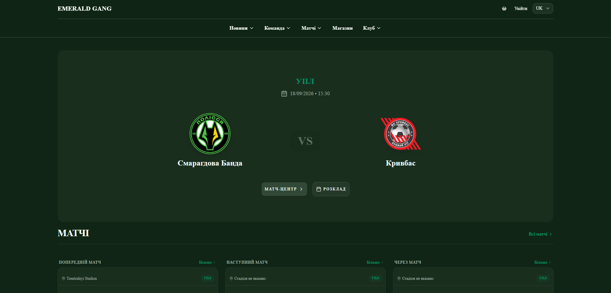</td>
    <td width="50%">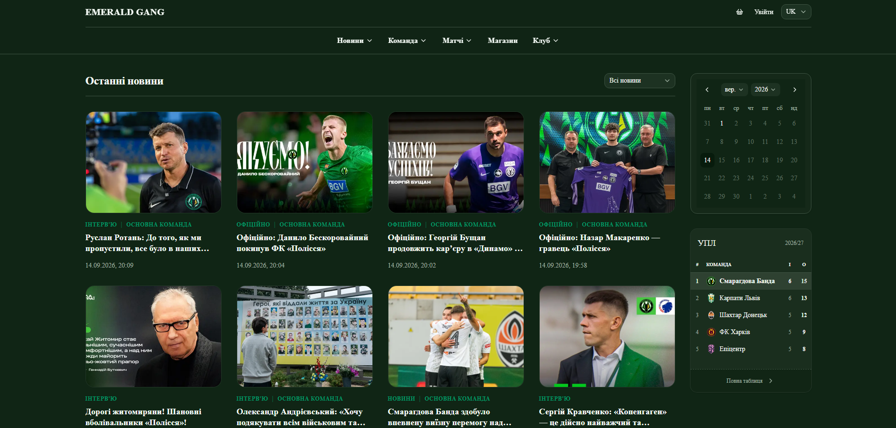</td>
  </tr>
  <tr>
    <td align="center"><sub>Home page</sub></td>
    <td align="center"><sub>News</sub></td>
  </tr>
  <tr>
    <td width="50%">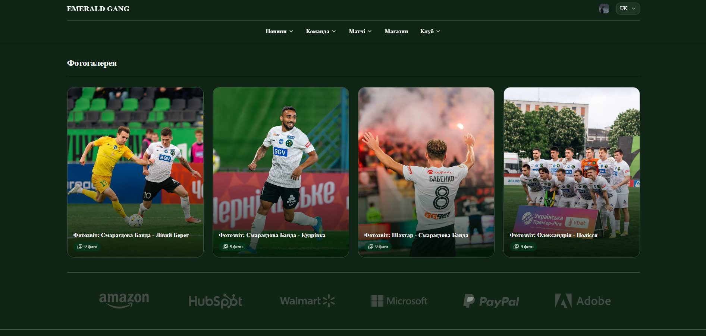</td>
    <td width="50%">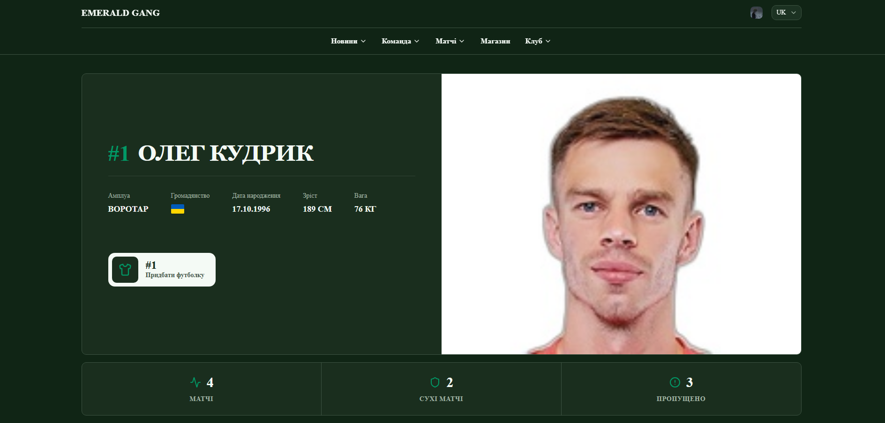</td>
  </tr>
  <tr>
    <td align="center"><sub>Photo gallery</sub></td>
    <td align="center"><sub>Team – player profile</sub></td>
  </tr>
  <tr>
    <td width="50%">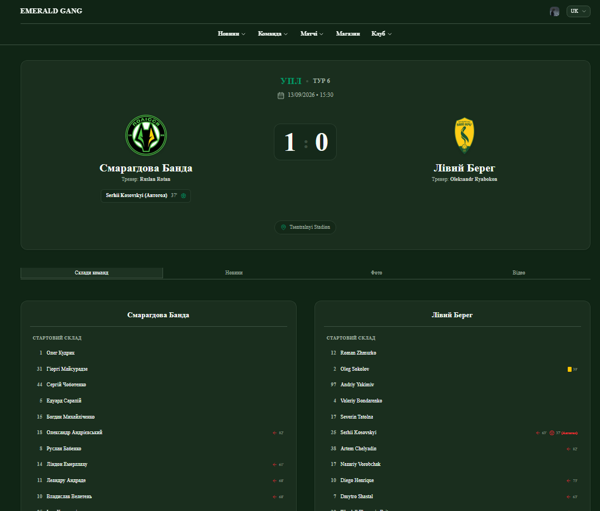</td>
    <td width="50%">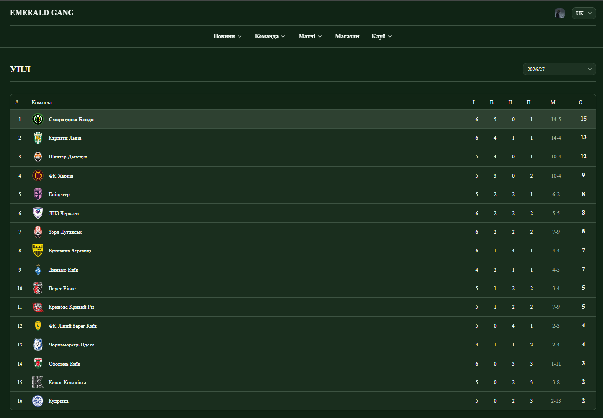</td>
  </tr>
  <tr>
    <td align="center"><sub>Match center – match report</sub></td>
    <td align="center"><sub>League standings</sub></td>
  </tr>
  <tr>
    <td width="50%">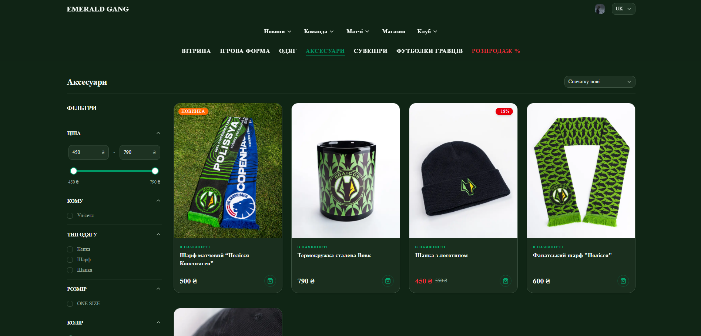</td>
    <td width="50%">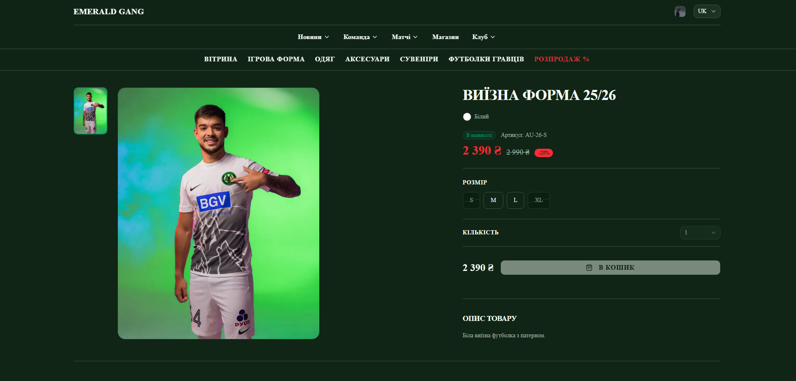</td>
  </tr>
  <tr>
    <td align="center"><sub>Fan shop – catalog</sub></td>
    <td align="center"><sub>Fan shop – product page</sub></td>
  </tr>
  <tr>
    <td colspan="2" align="center">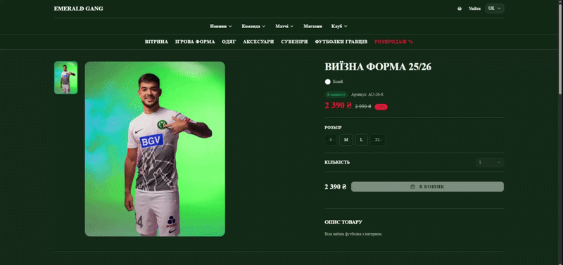</td>
  </tr>
  <tr>
    <td colspan="2" align="center"><sub>Cart (Zustand + persist) → guest checkout → linking a guest order to an account</sub></td>
  </tr>
</table>

### Admin panel

<table>
  <tr>
    <td width="50%">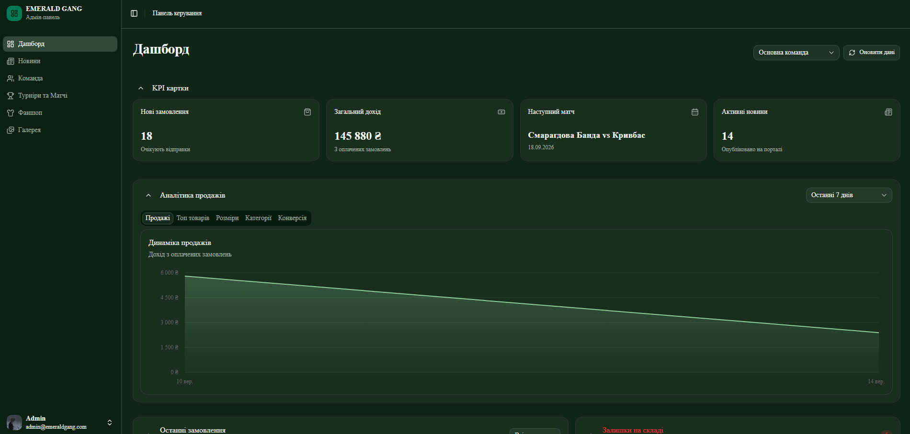</td>
    <td width="50%">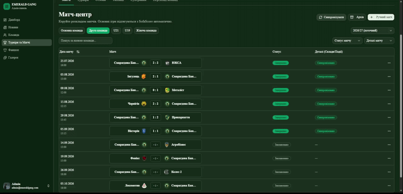</td>
  </tr>
  <tr>
    <td align="center"><sub>Dashboard – KPIs and sales analytics</sub></td>
    <td align="center"><sub>One-click sync with Sofascore</sub></td>
  </tr>
</table>

## Key features

### Public portal

- **News** – a feed of news, interviews, and official club statements, linked to specific matches and players.
- **Photo gallery** – an archive of match and event photo reports, each album grouping a set of images.
- **Team** – player and coach profiles: bio, physical attributes, and nationality flag. A hybrid stats system combines historical figures with numbers computed dynamically from real match events.
- **Match center** – match calendar and detailed match reports (lineups, goals, cards, substitutions). Data syncs with Sofascore via RapidAPI – some updates run automatically on a schedule, others are triggered manually by an admin (see "Admin panel" below).
- **Standings** – table for a selected tournament with season filtering, updated automatically on a schedule (cron) or manually by an admin.
- **Fan shop** – merchandise catalog with size charts and discounts, a persistent cart that works without an account (Zustand + localStorage), and checkout via Stripe.
- **Checkout** – purchases are available both with an account and without registration (guest checkout).
  - A guest order is accessible via a signed, single-order access token appended to the confirmation link the guest is redirected to after checkout. The order page itself is publicly viewable by anyone with the link (personal details shown masked), while the token unlocks the full, unmasked details and order-management actions (such as cancellation) for whoever holds it.
  - If a guest later signs up via Google OAuth, their prior guest orders are linked to the new account automatically (matched by email).
  - If a user instead registers with email/password, they can link their guest orders manually from their profile by entering the order's phone number and its 6-character order ID.
- **i18n** – UI available in Ukrainian and English (next-intl).

### Admin panel

- **Dashboard** – KPI cards, sales analytics charts (Recharts), the 10 most recent orders, low-stock items (fewer than 5 units), and a list of finished matches still awaiting a detailed report.
- **News** – full CRUD for publications.
- **Team** – full CRUD for players and coaches. The player roster (coaches excluded) can be synced from Sofascore with one click.
- **Tournaments & matches** – manage matches, tournaments, seasons, standings, opponents, and team name translations. Via Sofascore you can: pull in all matches for the current season with one click, manually fetch detailed stats for a single match (lineups, goals, cards, substitutions), and update standings – automatically on a schedule (cron) or manually as a fallback.
- **Fan shop** – manage orders, products, merchandise, and categories.
- **Gallery** – manage photo content.
- **Roles** – Admin / User access separation.

## Running locally

### Requirements

- Node.js 20+
- npm

### Setup

```bash
# 1. Clone the repository
git clone https://github.com/Mar1kya/fc-web-portal.git
cd fc-web-portal

# 2. Install dependencies (skip scripts to avoid Husky in CI)
npm ci --ignore-scripts

# 3. Generate the Prisma client
npm run prisma-generate

# 4. Configure environment variables
cp .env.example .env.local
# Fill in the values in .env.local

# 5. Run database migrations
npx prisma migrate deploy

# 6. Start the dev server
npm run dev
```

The app will be available at: http://localhost:3000

> **Note on Husky:** step 2 intentionally skips the `prepare` script (`--ignore-scripts`), so pre-commit hooks (lint + type-check before commit) aren't installed automatically. If you plan to commit to this repo locally, install them manually: `npm run prepare`.

## Environment variables

Create a `.env.local` file in the project root (template in [`.env.example`](.env.example)):

```env
# Database (Neon PostgreSQL)
# Required – this is the variable Prisma actually uses (prisma.config.ts, lib/prisma.ts).
DATABASE_URL=

# NextAuth
AUTH_SECRET=                         # Secret key used to sign JWTs
AUTH_URL=                            # Base URL of the app
AUTH_TRUST_HOST=true                 # Trust the host header

# Google OAuth
AUTH_GOOGLE_ID=                      # Google OAuth app client ID
AUTH_GOOGLE_SECRET=                  # Google OAuth app client secret

# UploadThing
UPLOADTHING_TOKEN=                   # UploadThing API token
UPLOADTHING_SECRET=                  # UploadThing secret key

# Vercel Cron
CRON_SECRET=                         # Secret used to authorize Cron requests

# RapidAPI / Sofascore
RAPIDAPI_KEY=                        # Access key for Sofascore via RapidAPI

# Stripe
NEXT_PUBLIC_STRIPE_PUBLISHABLE_KEY=  # Stripe publishable key (client)
STRIPE_SECRET_KEY=                   # Stripe secret key (server)
STRIPE_WEBHOOK_SECRET=               # Secret used to verify Stripe webhook events

# Guest order access
GUEST_ORDER_TOKEN_SECRET=            # Secret used to sign guest order access tokens (generate with: openssl rand -hex 32)
```

> When connecting Neon through the Vercel integration, a number of extra variables are added automatically (`DATABASE_URL_UNPOOLED`, `PGHOST`, `POSTGRES_*`, etc.). The project doesn't use them – a single `DATABASE_URL` is enough. See `.env.example` for the full list.

## Available scripts

```bash
npm run dev            # Start the dev server
npm run build          # Production build
npm run start           # Start the production server
npm run lint            # Static analysis (ESLint)
npm run type-check      # TypeScript type checking
npm run prisma-generate # Generate the Prisma client
```

## CI/CD pipeline

The GitHub Actions pipeline runs on push and pull request to `main` and consists of four jobs:

`lint` → `type-check` → `build` → `deploy` (push to `main` only, after the previous jobs succeed)

| Job          | Description                                                                        |
| ------------ | ---------------------------------------------------------------------------------- |
| `lint`       | Static analysis via ESLint                                                         |
| `type-check` | TypeScript type checking via `tsc --noEmit`                                        |
| `build`      | Next.js production build + Prisma client generation                                |
| `deploy`     | Production deploy to Vercel via `vercel build` + `vercel deploy --prebuilt --prod` |

Configuration: [`.github/workflows/ci.yml`](.github/workflows/ci.yml)

## Project structure

```
fc-web-portal/
├── .github/workflows/         ← CI/CD pipeline (ci.yml)
├── .husky/                    ← Pre-commit hooks (lint + type-check)
├── prisma/                    ← DB schema (37 models) + migrations
├── public/                    ← Static files
├── src/
│   ├── actions/                ← Server Actions (mutation business logic, 19 files)
│   ├── app/
│   │   ├── [locale]/
│   │   │   ├── (admin)/        ← Admin panel (dashboard, news, team, tournaments, fan shop, gallery)
│   │   │   ├── (auth)/         ← Sign-in and sign-up pages
│   │   │   ├── (main)/         ← Public portal (news, team, matches, standings, club info, profile)
│   │   │   ├── (shop)/         ← Fan shop (catalog, cart, checkout, orders)
│   │   │   ├── [...catchAll]/  ← Unknown-route handler
│   │   │   ├── layout.tsx
│   │   │   └── not-found.tsx
│   │   └── api/
│   │       ├── auth/           ← NextAuth handlers
│   │       ├── cron/           ← Vercel Cron Jobs (5 tasks)
│   │       ├── uploadthing/    ← UploadThing file router
│   │       └── webhooks/
│   │           └── stripe/     ← Stripe webhook handler
│   ├── components/             ← UI components (layout, auth, shared, ui – shadcn/ui)
│   ├── hooks/                  ← Client React hooks
│   ├── i18n/                   ← next-intl configuration
│   ├── lib/                    ← Services (Sofascore, analytics), utilities, Prisma/Stripe clients, Zod schemas
│   ├── messages/                ← Translation files (uk.json, en.json)
│   ├── store/                   ← Zustand (fan shop cart)
│   ├── auth.ts                  ← NextAuth configuration
│   └── proxy.ts                 ← Combined middleware (NextAuth + next-intl)
├── .env.example                 ← Environment variable template (filled in locally as .env.local)
├── .gitignore
├── LICENSE                      ← MIT
├── components.json              ← shadcn/ui configuration
├── eslint.config.mjs            ← ESLint configuration
├── next.config.ts               ← Next.js configuration
├── next-auth.d.ts               ← NextAuth TypeScript types
├── postcss.config.mjs           ← PostCSS configuration (TailwindCSS v4)
├── prisma.config.ts             ← Prisma configuration
├── package.json
├── tsconfig.json
└── vercel.json                  ← Vercel Cron Jobs configuration
```

Each admin and public section (e.g. `admin/tournaments`, `matches/[slug]`, `shop/product/[slug]`) has its own `_components/`, and list views have a separate `archive/` sub-route for archived items. This nesting is intentionally omitted from the tree above to keep the overview readable.

> **Cron jobs:** `vercel.json` defines 4 scheduled cron jobs (`update-standings`, `sync-matches`, `sync-details`, `cancel-expired-orders`). A fifth route, `sync-roster`, uses the same structure but is triggered manually from the admin panel rather than on a schedule.

## License

This project is distributed under the MIT License – see [LICENSE](./LICENSE) for details.
